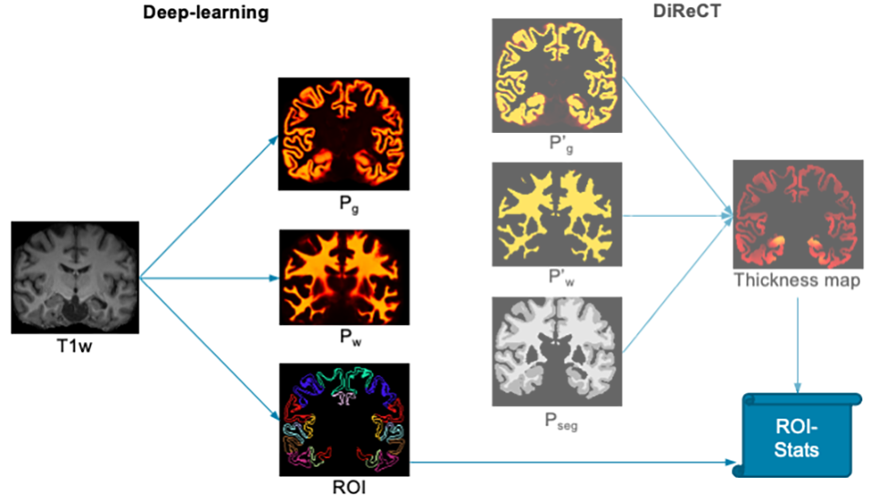

# About DL+DiReCT v8

DL+DiReCT combines a deep learning-based neuroanatomy segmentation and cortex parcellation with a diffeomorphic registration technique to measure cortical thickness from T1w MRI.

This repo is a copy of the [original](https://github.com/SCAN-NRAD/DL-DiReCT) and serves as a demo for the new retrained version of the model (i.e. **v8**). With this (retrained) version the model gain lesion awareness and hypointensities regions segmentation.  We include few patient data examples to test model on ```/pat_test_data``` folder.

To ensure consistency with the companion thesis work, we will only cover the segmentation capabilities only of the DL+DiReCT pipeline.




If you are using DL+DiReCT in your research, please cite ([bibtex](citations.bib)) the corresponding [publication](https://doi.org/10.1002/hbm.25159):
```
Rebsamen, M, Rummel, C, Reyes, M, Wiest, R, McKinley, R.
Direct cortical thickness estimation using deep learning‐based anatomy segmentation and cortex parcellation.
Human brain mapping. 2020; 41: 4804-4814. https://doi.org/10.1002/hbm.25159
```


# Installation
## Create virtual environment (optional)
Download and install [Miniconda](https://conda.io/projects/conda/en/latest/user-guide/install/linux.html) and create a new conda environment:

```bash
conda create -y -n DL_DiReCT python=3.10
source activate DL_DiReCT
```

## Install DL+DiReCT
```bash
cd ${HOME}
git clone https://github.com/Mappo23/DL-DiReCT-v8
cd DL-DiReCT-v8
pip install numpy && pip install -e .
```

# Usage
Run dl+direct on a patient T1-weighted MRI with:
```bash
source activate DL_DiReCT

dl+direct -n -k --model v8 <path_to_t1_input.nii.gz> <output_dir>
```

Following files of interest are generated in the output directory:
```
- T1w_norm.nii.gz		Re-sampled input volume
- T1w_norm_seg.nii.gz		Segmentation
- seg_<ROI>.nii.gz              <ROI> label probability map   
- lesion.nii.gz                 lesion label probability map   
- brain.nii.gz                  brain mask probability map
- result-vol.csv		Segmentation volumes
- label_def.csv			Label definitions of the segmentation
```


```lesion``` region is identified by label code ```50000```, the associated color is *bright yellow*.


## Other Available Models
The following models are available with the ```--model ...``` option:
- ```v0```: Default, for un-enhanced T1w MRI, cortex parcellation with *Desikan-Killiany* atlas ([Rebsamen et al., 2020](https://doi.org/10.1002/hbm.25159))
- ```v6```: For both contrast-enhanced and un-enhanced MRI ([Rebsamen et al., 2022](https://doi.org/10.1002/hbm.26117))
- ```v7```: Same as v6, with 74 region per hemisphere according the *Destrieux* atlas ([Rebsamen et al., 2022](https://doi.org/10.1002/hbm.26117))

# [Frequently Asked Questions](doc/faq.md)
For further details, consult the corresponding [publication](https://doi.org/10.1002/hbm.25159) and the [FAQ](doc/faq.md) or [contact us](http://www.scancore.org/index.php/research/imageanalytics)